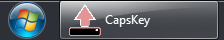

# CapsKey User Guide

## Contents
0. [Overview](#Overview)
0. [Main window](#MainWindow)
   0. [Caps Lock state slider](#Slider)
   0. [Drag handle](#DragHandle)
   0. [Help](#Help)
   0. [Minimise](#Minimise)
   0. [Close](#Close)
   0. [Open Settings](#OpenSettings)
0. [Settings window](#SettingsWindow)

## Overview 

This little Windows app:

- Displays on-screen the current state of the Caps Lock key (active/inactive),
- Toggles the Caps Lock key state (using the on-screen slider *and/or* an optional shortcut key), *and*
- Optionally suppresses Caps Lock key presses (to maintain the current state).

This may be useful if you have a faulty keyboard, to work-around problems including:

- Caps Lock key light not illuminating when active,
- Caps Lock key presses being ineffectual, *and/or*
- Caps Lock key ‘pressing’ itself at random intervals.

## Main window 

### Caps Lock state slider 
This control shows either state of the Caps Lock key:

0.  Caps Lock **inactive**; press or slide to activate, *or*
0.  Caps Lock **active**; press or slide to deactivate.
 
### Drag Handle 
Press and drag the '**::::**' handle to move the window anywhere on-screen.

### Help 
Press the '**?**' icon to view this user guide.

### Minimise 
Press the '**–**' icon to hide the main window.

Press the Windows taskbar icon to restore this window.

### Close 
Press the '**×**' icon to close the application.

Locate the "**CapsKey**" folder under "**Windows Start Menu » All Programs**" to re-open.

### Open Settings 
Press the '' icon to open the Settings window.

## Settings window 
