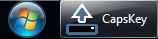

# CapsKey User Guide

## Contents
0. [Overview](#Overview)
0. [Main Window](#MainWindow)
   0. [Caps Lock Toggle Switch](#Slider)
   0. [Drag / Move](#DragHandle)
   0. [Help](#Help)
   0. [Minimise](#Minimise)
   0. [Close](#Close)
   0. [Open Settings](#OpenSettings)
0. [Settings Window](#SettingsWindow)
   0. [Keep On Top](#KeepOnTop)
   0. [Start With Windows](#StartWithWindows)
   0. [Suppress Caps Lock Key](#SuppressCapsLockKey)
   0. [Shortcut](#Shortcut)
   0. [View Log File](#ViewLogFile)
   0. [Close](#CloseSettings)
0. [Source Code](#SourceCode)

## Overview 

This little Windows app:

- Displays the current state of the Caps Lock key (active / inactive),
- Toggles the Caps Lock key state (using the [toggle switch](#Slider) or a [shortcut key](#Shortcut)), *and*
- Optionally suppresses Caps Lock key presses (to maintain the current state).

This may be useful if you have a faulty keyboard, to work-around Caps Lock key problems including:

- LED not illuminating when active,
- presses being ineffectual, *and/or*
- toggling itself at random intervals.

## Main Window 

### Caps Lock Toggle Switch 
This control shows either state of the Caps Lock key:

0.  Caps Lock **inactive**; press or slide to activate, *or*
0.  Caps Lock **active**; press or slide to deactivate.
 
### Drag / Move 
Press and drag the '**::::**' handle to move the window anywhere on-screen.

### Help 
Press the '**?**' icon to view this user guide.

### Minimise 
Press the '**–**' icon to hide the main window.

Press the Windows taskbar icon to restore this window.

### Close 
Press the '**×**' icon to close the application.

Locate the "**CapsKey**" folder under "**Windows Start Menu » All Programs**" to re-open.

### Open Settings 
Press the '' icon to open the [Settings Window](#SettingsWindow).

## Settings Window 
This window will be displayed on pressing the [Open Settings](#OpenSettings) icon.

### Keep On Top 
Selecting 'Keep on top' will display this app's [Main Window](#MainWindow) in front of all other windows.

### Start With Windows 
Select to auto-start this application when you log-in to Windows.

### Suppress Caps Lock Key 
If 'Suppress' is selected, pressing the Caps Lock key will no longer toggle its state.

### Shortcut 
Select a shortcut key to toggle the Caps Lock key state.

You may also specify a combination of shortcut keys by selecting the **Alt**, **Shift** &/or **Control** options. 

For example, with **Alt** & **F7** selected (as shown in the screenshot above), pressing both **Alt** + **F7** keys (at once) will flip the Caps Lock key state.   

### View Log File 
Press the '**View log file**' button to open the latest file (named `CapsKey.log`) containing messages from this application.

Older messages may be found in numbered log files (`CapsKey.log.1` → `CapsKey.log.4`) within the same directory (i.e. the application's installation directory, typically `C:\Program Files (x86)\CapsKey`).

Log files may be useful to the developer in troubleshooting any problem that you may encounter with this application.

### Close 
Press the '**Close**' button to hide the settings window. 

Any setting change is automatically applied and stored upon selecting the new setting.

## Source Code 
The code for this app is maintained at [www.github.com/computingman/CapsKey](https://github.com/computingman/CapsKey).

The [Caps Lock Toggle Switch](#Slider) uses code from [www.github.com/ejensen/toggle-switch-control](https://github.com/ejensen/toggle-switch-control).